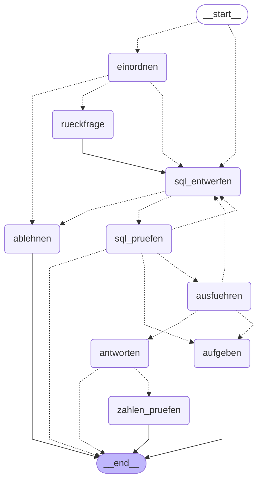

# Agent-Graph

```mermaid
---
config:
  flowchart:
    curve: linear
---
graph TD;
	__start__([<p>__start__</p>]):::first
	einordnen(einordnen)
	rueckfrage(rueckfrage)
	ablehnen(ablehnen)
	sql_entwerfen(sql_entwerfen)
	sql_pruefen(sql_pruefen)
	ausfuehren(ausfuehren)
	antworten(antworten)
	zahlen_pruefen(zahlen_pruefen)
	aufgeben(aufgeben)
	__end__([<p>__end__</p>]):::last
	__start__ -.-> einordnen;
	__start__ -.-> sql_entwerfen;
	antworten -.-> __end__;
	antworten -.-> zahlen_pruefen;
	ausfuehren -.-> antworten;
	ausfuehren -.-> aufgeben;
	ausfuehren -.-> sql_entwerfen;
	einordnen -.-> ablehnen;
	einordnen -.-> rueckfrage;
	einordnen -.-> sql_entwerfen;
	rueckfrage --> sql_entwerfen;
	sql_entwerfen -.-> ablehnen;
	sql_entwerfen -.-> sql_pruefen;
	sql_pruefen -.-> __end__;
	sql_pruefen -.-> aufgeben;
	sql_pruefen -.-> ausfuehren;
	sql_pruefen -.-> sql_entwerfen;
	ablehnen --> __end__;
	aufgeben --> __end__;
	zahlen_pruefen --> __end__;
	classDef default fill:#f2f0ff,line-height:1.2
	classDef first fill-opacity:0
	classDef last fill:#bfb6fc

```
